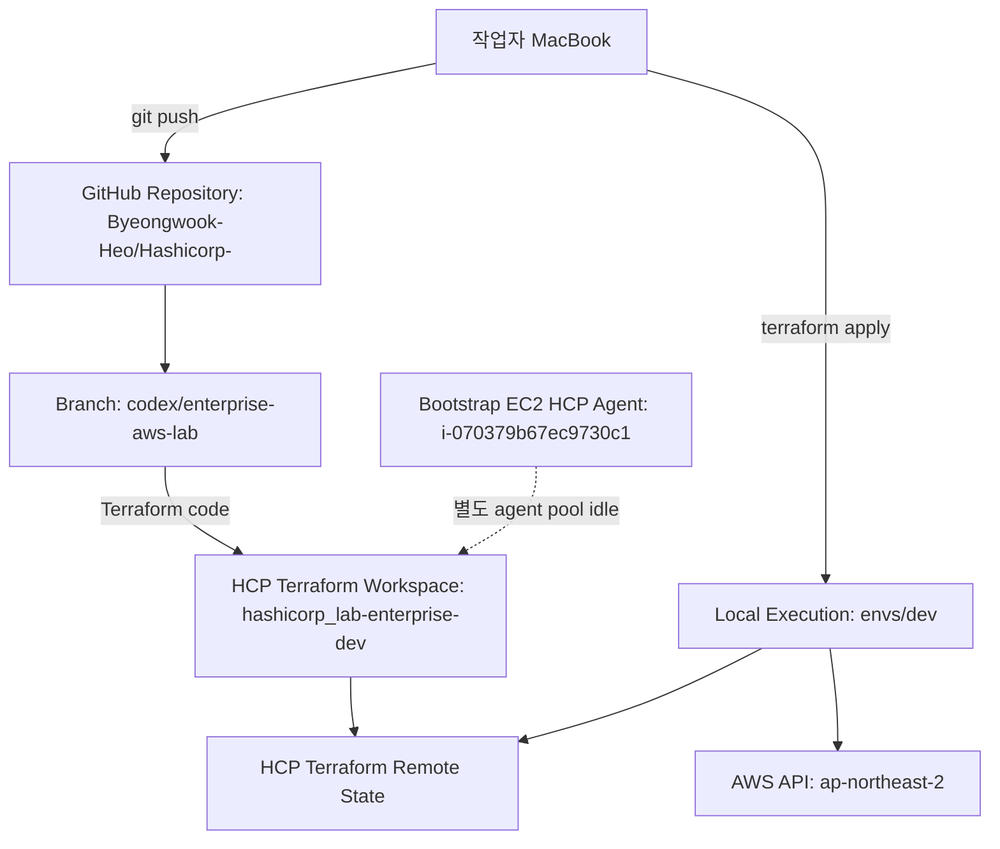
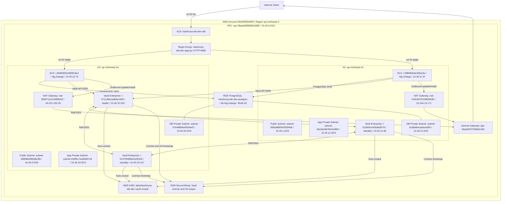
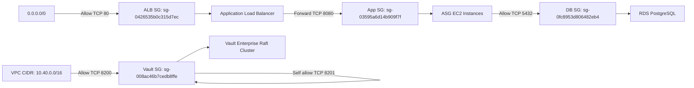
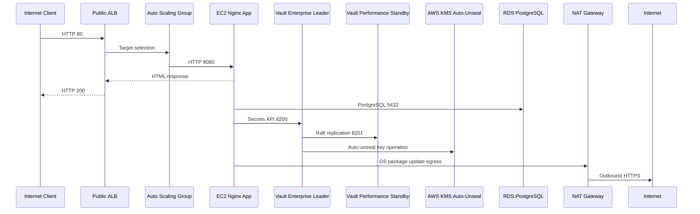

# HashiCorp Enterprise AWS Lab 구성도

작성일: 2026-06-23

## 1. 전체 운영 흐름

## 2. AWS 전체 구성도

## 3. 보안 그룹 관계

## 4. 요청 및 Vault 처리 흐름

## 5. 운영 메모

- Vault Enterprise는 3노드 Raft 클러스터로 초기화됨.
- Vault 리더는 `10.40.10.202`, standby는 `10.40.11.68`, `10.40.10.147`.
- Vault init 결과는 `/hashicorp-lab/dev/vault/init` SSM SecureString에 저장됨.
- `/Users/heobyeong-ug/Downloads/vault.hclic`는 `2026-05-31` 만료라 기동 실패했고, 현재 SSM 라이선스 파라미터는 `vault_exp20260930.hclic` 내용으로 갱신됨.
- ALB HTTP 응답 정상 확인됨.
- RDS는 `available`, Multi-AZ 활성화 상태.
- 실습이 끝나면 `envs/dev`에서 `terraform destroy`로 비용 발생 리소스를 내려야 함.
