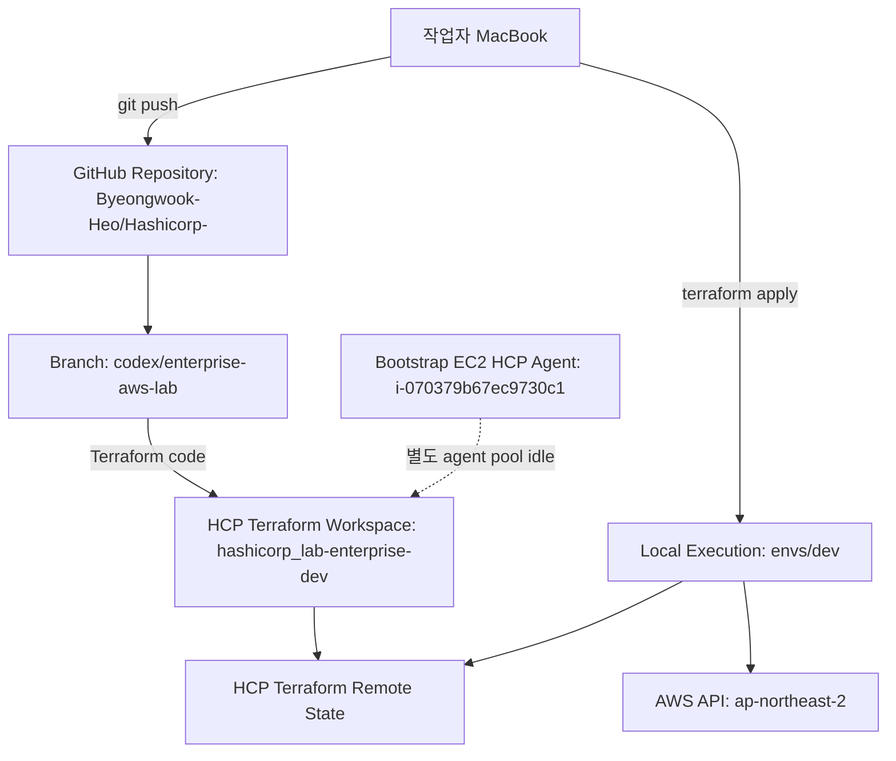
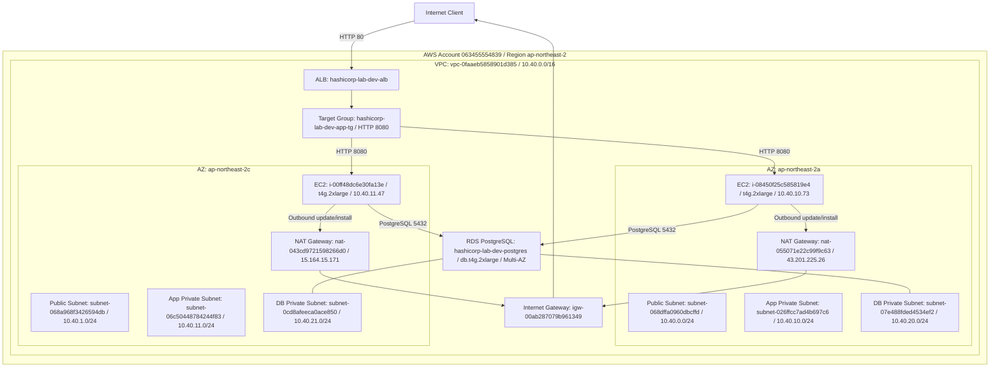
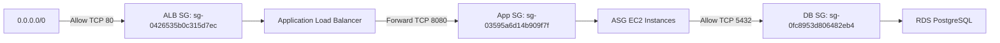
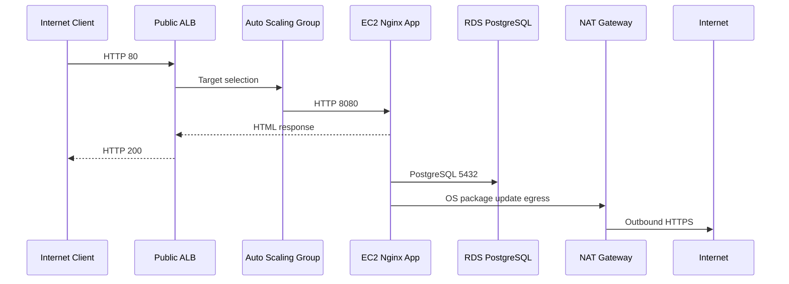

# HashiCorp Enterprise AWS Lab 구성도

작성일: 2026-06-23

## 1. 전체 운영 흐름

## 2. AWS 전체 구성도

## 3. 보안 그룹 관계

## 4. 요청 처리 흐름

## 5. 리소스 요약

| 영역 | 리소스 | 값 |
|---|---|---|
| Repository | GitHub | `Byeongwook-Heo/Hashicorp-` |
| Branch | Terraform code | `codex/enterprise-aws-lab` |
| HCP Terraform | Workspace | `hashicorp_lab-enterprise-dev` |
| HCP Terraform | Execution mode | `local` |
| HCP Terraform | Working directory | `envs/dev` |
| AWS | Account | `063455554839` |
| AWS | Region | `ap-northeast-2` |
| Network | VPC | `vpc-0faaeb5858901d385` |
| Network | VPC CIDR | `10.40.0.0/16` |
| Public Entry | ALB DNS | `hashicorp-lab-dev-alb-1478507171.ap-northeast-2.elb.amazonaws.com` |
| Public Entry | ALB state | `active` |
| Compute | ASG | `hashicorp-lab-dev-app-asg` |
| Compute | ASG capacity | desired `2`, min `2`, max `4` |
| Compute | Instance type | `t4g.2xlarge` |
| Compute | App instance 1 | `i-08450f25c585819e4`, `10.40.10.73`, `ap-northeast-2a`, `healthy` |
| Compute | App instance 2 | `i-00ff48dc6e30fa13e`, `10.40.11.47`, `ap-northeast-2c`, `healthy` |
| Data | RDS endpoint | `hashicorp-lab-dev-postgres.cx4i8kgqav98.ap-northeast-2.rds.amazonaws.com:5432` |
| Data | RDS engine | PostgreSQL `16.14` |
| Data | RDS class | `db.t4g.2xlarge` |
| Data | RDS Multi-AZ | `true` |
| Bootstrap | HCP Agent EC2 | `i-070379b67ec9730c1`, `t4g.2xlarge`, public IP `52.79.210.204` |

## 6. 서브넷 배치

| Tier | AZ | Subnet ID | CIDR | Public IP on launch |
|---|---|---|---|---|
| Public | `ap-northeast-2a` | `subnet-068dffa0960dbcffd` | `10.40.0.0/24` | `true` |
| Public | `ap-northeast-2c` | `subnet-068a968f3426594db` | `10.40.1.0/24` | `true` |
| App | `ap-northeast-2a` | `subnet-026ffcc7ad4b697c6` | `10.40.10.0/24` | `false` |
| App | `ap-northeast-2c` | `subnet-06c50448784244f83` | `10.40.11.0/24` | `false` |
| Data | `ap-northeast-2a` | `subnet-07e488fded4534ef2` | `10.40.20.0/24` | `false` |
| Data | `ap-northeast-2c` | `subnet-0cd8afeeca0ace850` | `10.40.21.0/24` | `false` |

## 7. 운영 메모

- 현재 `terraform plan` 결과는 `No changes`로 확인됨.
- ALB HTTP 응답 정상 확인됨.
- RDS는 `available`, Multi-AZ 활성화 상태.
- 실습이 끝나면 `envs/dev`에서 `terraform destroy`로 비용 발생 리소스를 내려야 함.

